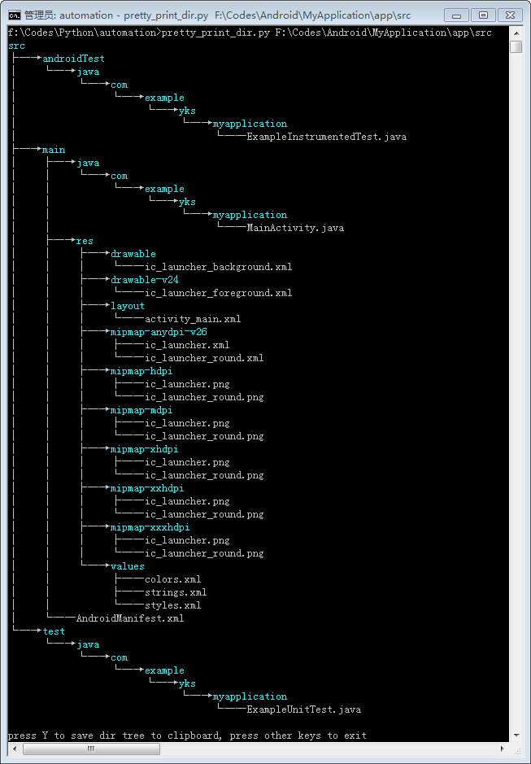

# The uiautomation module

This module is for UIAutomatoin on Windows(Windows XP with SP3, Windows Vista, Windows 7 and Windows 8/8.1/10).
It supports UIAutomatoin for the applications which implmented UIAutomation Provider, such as MFC, Windows Form, WPF, Modern UI(Metro UI), Qt(Partly) and Firefox(**version<=56 or >=60**).

uiautomation is shared under the Apache Licence 2.0.
This means that the code can be freely copied and distributed, and costs nothing to use.

You can install uiautomation by "pip install uiautomation". After installation, a automation.py that calls uiautomation will be in 'C:\PythonXX\Scripts\'.
You use this script to traverse UI controls.

Run 'C:\PythonXX\Scripts\automation.py -h' for help.
Run automate_notepad_py3.py to see a simple demo.

If "RuntimeError: Can not get an instance of IUIAutomation" occured when running uiautomation.py,
You need to install update [KB971513](https://support.microsoft.com/en-us/kb/971513) for your Windows(Mostly Windows XP).
You can also download it from here [https://github.com/yinkaisheng/WindowsUpdateKB971513ForIUIAutomation](https://github.com/yinkaisheng/WindowsUpdateKB971513ForIUIAutomation)

On Windows 8/8.1, to automate a Metro App, the app must be foreground. If a Metro App was switched to background, uiautomation can't fetch it controls' information.

By the way, You'd better run python as administrator. Otherwise uiautomation may fail to enumerate controls under some circumstances.

[Requirements:](https://msdn.microsoft.com/zh-cn/library/ee671406(v=vs.85).aspx)

Microsoft UIAutomation Minimum supported client:
Windows 7, Windows Vista with SP2 and Platform Update for Windows Vista, Windows XP with SP3 and Platform Update for Windows Vista [desktop apps only]

Microsoft UIAutomation Minimum supported server:
Windows Server 2008 R2, Windows Server 2008 with SP2 and Platform Update for Windows Server 2008, Windows Server 2003 with SP2 and Platform Update for Windows Server 2008 [desktop apps only]

C++ dll source code: [UIAutomationClient](https://github.com/yinkaisheng/UIAutomationClient)

--------------------------------------------------------------------------------
How to use uiautomation?
run '**automation.py -h**'

Understand the arguments of automation.py, and try the following examples  
**automation.py -r -d 1 -t 0**, print desktop(the root of control tree) and it's children(top level windows)  
**automation.py -t 0 -n -m**, print current active window's controls, show fullname, show more properties
  
run notepad.exe, run automation.py -t 3, swith to Notepad and wait for 5 seconds  
  
automation.py will print the controls of Notepad and save them to @AutomationLog.txt:  
  
ControlType: WindowControl    ClassName: Notepad  
　　ControlType: EditControl    ClassName: Edit  
　　　　ControlType: ScrollBarControl    ClassName:  
　　　　　　ControlType: ButtonControl    ClassName:  
　　　　　　ControlType: ButtonControl    ClassName:  
　　　　ControlType: ScrollBarControl    ClassName:  
　　　　　　ControlType: ButtonControl    ClassName:  
　　　　　　ControlType: ButtonControl    ClassName:  
　　　　ControlType: ThumbControl    ClassName:  
　　ControlType: StatusBarControl    ClassName:  
　　　　ControlType: TextControl    ClassName:  
　　　　ControlType: TextControl    ClassName:  
...  

run the following code
```python
import subprocess
import uiautomation as automation

print(automation.GetRootControl())
subprocess.Popen('notepad.exe')
notepadWindow = automation.WindowControl(searchDepth = 1, ClassName = 'Notepad')
print(notepadWindow.Name)
notepadWindow.SetTopmost(True)
edit = notepadWindow.EditControl()
edit.SetValue('Hello')
edit.SendKeys('{Ctrl}{End}{Enter}World')

```
automation.GetRootControl() returns the root control  
automation.WindowControl(searchDepth = 1, ClassName = 'Notepad') creates a WindowControl, the parameters specify how to search the control  
the following parameters can be used  
searchFromControl = None,   
searchDepth = 0xFFFFFFFF,   
searchWaitTime = SEARCH_INTERVAL,   
foundIndex = 1  
Name  
SubName  
RegexName  
ClassName  
AutomationId  
ControlType  
Depth  

See Control.\_\_init\_\_ for the comments of the parameters  
See automation_notepad_py3.py for a detailed example  

**If automation.py can't print the controls you see.
Maybe the controls were built by DirectUI(or CustomControl), not UI Frameworks supplied by Microsoft.
In order to support UIAutomation, an UI Framework must implement [UI Automation Provider](https://msdn.microsoft.com/en-us/library/windows/desktop/ee671597(v=vs.85).aspx).**

A Microsoft UI Automation provider is a software object that exposes an element of an application's UI so that accessibility client applications can retrieve information about the element and invoke its functionality. In general, each control or other distinct element in a UI has a provider.

Microsoft includes a provider for each of the standard controls that are supplied with Microsoft Win32, Windows Forms, and Windows Presentation Foundation (WPF). This means that the standard controls are automatically exposed to UI Automation clients; you do not need to implement any accessibility interfaces for the standard controls.

If your application includes any custom controls, you need to implement UI Automation providers for those controls to make them accessible to accessibility client applications. You also need to implement providers for any third party controls that do not include a provider. You implement a provider by implementing UI Automation provider interfaces and control pattern interfaces.

--------------------------------------------------------------------------------
Another UI tool inspectX86.exe or inspectX64.exe supplied by Microsoft can also be used to see the UI elements.

[Inspect (Inspect.exe)](https://msdn.microsoft.com/en-us/library/windows/desktop/dd318521%28v=vs.85%29.aspx) is a Windows-based tool that enables you select any UI element and view the element's accessibility data. You can view Microsoft UI Automation properties and control patterns, as well as Microsoft Active Accessibility properties. Inspect also enables you to test the navigational structure of the automation elements in the UI Automation tree, and the accessible objects in the Microsoft Active Accessibility hierarchy.

Inspect is installed with the Windows Software Development Kit (SDK) for Windows 8. (It is also available in previous versions of Windows SDK.) It is located in the \bin\<platform> folder of the SDK installation path (Inspect.exe).

Inspect


--------------------------------------------------------------------------------
Note:
This module was developed in my spare time and for my personal use.
I only tested it with official CPython 2.7, 3.4 and 3.6.

--------------------------------------------------------------------------------

[代码原理简单介绍](http://www.cnblogs.com/Yinkaisheng/p/3444132.html)

Some screenshots:

Batch rename pdf bookmark


Firefox


WindowsDesktop


Qt5


Wireshark(version must >= 2.0)


QQ


Pretty print dir
